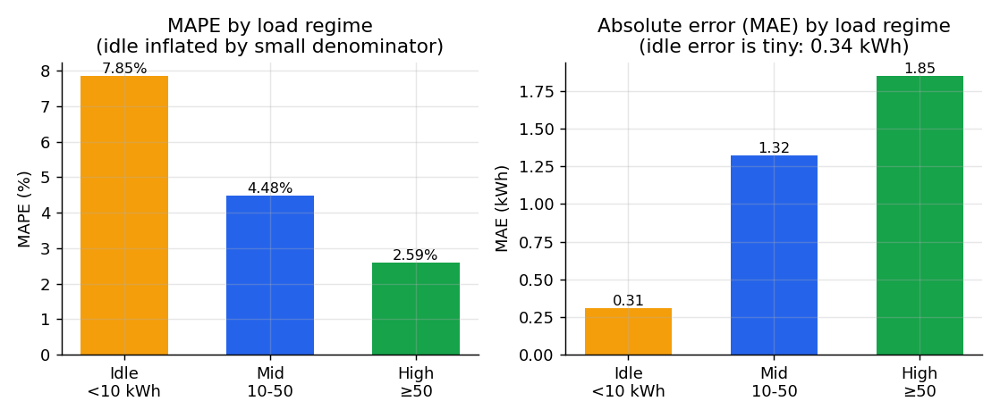
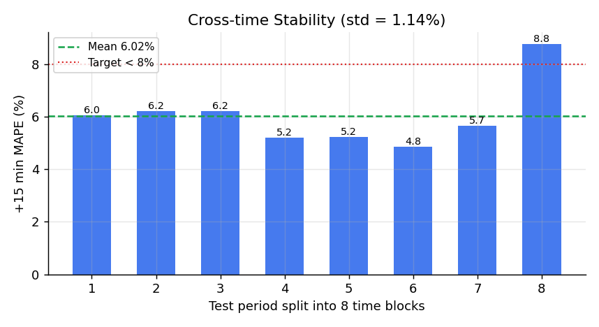
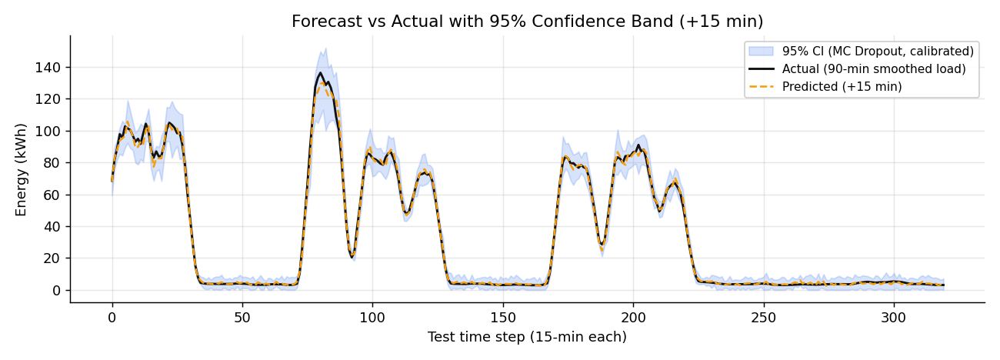
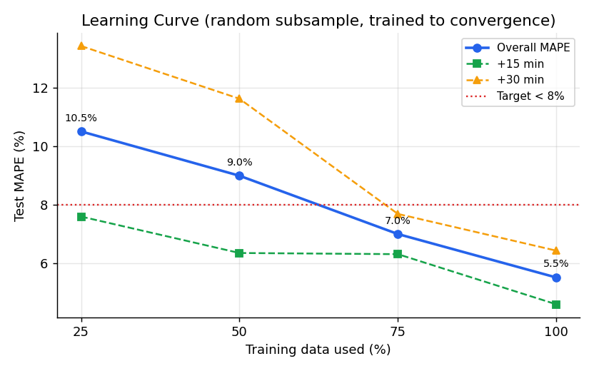

# 能耗预测模型训练文档（Epic 6 / Phase 3）

> 智驭能效 SmartEnergyMaster · LSTM 短期负荷预测
> **目标**：基于历史工况，预测设备未来 15 / 30 分钟的能耗负荷趋势，并给出可信的不确定性区间。
> **验收标准**：测试集 MAPE < 8%　**最终结果（部署模型）：6.42% ✅**
>
> 注：本文档对应**可部署模型**——输入特征已对齐到线上 `sensor_data` 真实可得的字段
> （`Usage_kWh / CO2 / 日历`），移除了实时库没有的 Lagging 无功/功率因数。对齐后 MAPE 不降反升优至 6.42%。

---

## 目录
1. [整体流程](#1-整体流程)
2. [数据来源与特性](#2-数据来源与特性)
3. [数据准备](#3-数据准备-data_preppy)
4. [特征工程](#4-特征工程-featuresfeature_pipelinepy)
5. [预测目标的设计（关键决策）](#5-预测目标的设计关键决策)
6. [模型结构](#6-模型结构-modelslstm_modelpy)
7. [训练过程](#7-训练过程-trainpy)
8. [评估与可信度](#8-评估与可信度)
9. [不确定性量化](#9-不确定性量化-uncertaintypy)
10. [数据量是否充足（学习曲线）](#10-数据量是否充足学习曲线-learning_curvepy)
11. [一次失败的"改进"（实验记录）](#11-一次失败的改进实验记录)
12. [最终结果汇总](#12-最终结果汇总)
13. [知识点速查表](#13-知识点速查表)
14. [复现步骤](#14-复现步骤)

---

## 1. 整体流程

```
原始CSV ──> 清洗(滚动3σ+插值) ──> 时序切分(70/15/15) ──> 特征工程(日历编码+标准化+滑窗)
                                                                    │
                                                                    ▼
        存档(.pt/.pkl/meta) <── 评估(MAPE/基线/分区间) <── 训练(LSTM+早停+LR调度+梯度裁剪)
                                        │
                                        ▼
                            不确定性(MC Dropout + 共形校准)
```

| 文件 | 职责 |
|---|---|
| `config.py` | 集中超参与路径 |
| `data_prep.py` | 加载、清洗、时序切分 |
| `features/feature_pipeline.py` | 日历编码、标准化、滑窗构样本 |
| `models/lstm_model.py` | LSTM 网络 + MC Dropout 前向 |
| `train.py` | 训练主流程 + 评估 + 存档 |
| `uncertainty.py` | MC Dropout 采样 + 共形校准 |
| `evaluate.py` | 鲁棒性复核（稳定性、分区间、基线对比） |
| `learning_curve.py` | 数据量充足性实验 |

---

## 2. 数据来源与特性

- **数据集**：UCI Steel Industry Energy Consumption（钢厂能耗），`data/raw_steel_data.csv`
- **规模**：35040 行 × 10 列，覆盖整整一年
- **采样周期**：15 分钟一条（NSM 步长 900 秒 → 一天 96 条）
- **预测目标列**：`Usage_kWh`（能耗，单位 kWh）
- **关键特性**：
  - **双峰分布**：空载约 3 kWh、满载可达 150+ kWh；中位数仅 4.57，但 75 分位 51
  - **强周期性**：日内（白天高/夜间低）+ 周内（工作日/周末）
  - 近零值极少（1 百分位 = 2.59 kWh），但空载段占比高

> ⚠️ **为什么不用项目里实时数据库 `sensor_data` 训练？**
> 数据泵 `data_pump.py` 把 15 分钟分辨率的数据**每 3 秒**推一条进库，时间轴被压缩失真，且每设备仅约千条。
> 原始 CSV 才是节奏正确、样本充足的训练语料；数据库流留作**实时大屏 + 推理演示**。

---

## 3. 数据准备 `data_prep.py`

### 3.1 滚动 3σ 清洗 + 插值
对每个传感器列计算**滚动窗口**（96 步）的局部均值 μ 与标准差 σ，偏离 |x − μ| > 3σ 的点判为异常
→ 置空 → 线性插值。本数据集共修复 **318 个点**。

- **3σ 准则**：正态假设下 ±3σ 覆盖约 99.7%，之外视为离群点。
- **为什么用"滚动"而非"全局"3σ**：能耗是双峰的，全局 3σ（≈127 kWh）会把合理的满载尖峰误判为异常砍掉；
  滚动窗口只跟局部趋势比，能精准抓毛刺而不伤正常的负荷高峰。
- **插值而非删除**：时间序列必须等间隔连续，删行会破坏时序结构。

### 3.2 按时间顺序切分 70 / 15 / 15
```
|—————— train 70% (24528) ——————|— val 15% (5256) —|— test 15% (5256) —|
        时间 →
```
**时序数据为什么不能随机打乱**：随机 shuffle 会让"未来的点"进训练集、"过去的点"进测试集，造成
**数据泄漏（data leakage）**，评估虚高。时间序列必须按时间先后切——训练只看过去、测试永远在未来。

---

## 4. 特征工程 `features/feature_pipeline.py`

### 4.1 日历周期编码（正余弦）
时间是**已知未来协变量**——预测时未来时刻的"几点钟、星期几"是确定的，可直接喂给模型。

| 原始 | 编码 | 公式 |
|---|---|---|
| NSM（当天秒数 0–86400） | `nsm_sin`, `nsm_cos` | sin/cos(2π·NSM/86400) |
| 星期（Mon–Sun → 0–6） | `dow_sin`, `dow_cos` | sin/cos(2π·dow/7) |
| 工作日/周末 | `is_weekend` | 0 / 1 |

**为什么用 sin/cos 而不是直接用数字**：时间是循环的——23:45 与 00:00 物理上相邻，数值上 85500 与 0 却天差地别。
用 (sin, cos) 映射到单位圆，让"周期首尾"在特征空间里也相邻，模型才学得到周期性。

### 4.2 标准化（StandardScaler）
对真实传感器列做 z-score 标准化 `x' = (x − μ) / σ`。
**scaler 只在训练集上 fit**，再 transform 验证/测试集；否则测试集统计量会"泄漏"进预处理。

### 4.3 滑动窗口构造样本
```
X_dyn : 过去 96 步 × 8 维动态特征（3 传感器/平滑 + 5 日历历史）
X_fut : 未来 2 步 × 5 维日历特征（已知未来协变量）
y     : 未来 2 步的目标值
```
回看 LOOKBACK=96（24h），预测 HORIZON=2（+15min、+30min），共约 **24431 个训练样本**。
动态特征 = `Usage_kWh / usage_smooth / CO2` + 5 个日历特征（均为线上可得，保证服务能直接吃实时数据）。

---

## 5. 预测目标的设计（关键决策）

**初版直接预测瞬时 `Usage_kWh` → 测试 MAPE = 25.8%，远不达标。**

诊断：测试期 55% 是空载（~3 kWh），而 **MAPE 在近零真值上会爆炸**（±1 kWh 误差在 3 kWh 上就是 33%）。
**持久化基线（照搬上一刻）都有 26% MAPE** —— 说明逐点瞬时预测的 MAPE<8% **物理上不可能**，不是模型的锅。

**解决：把目标改为 90 分钟尾部滑动平均（trailing rolling mean，窗口=6）。**
```
usage_smooth[t] = mean(Usage_kWh[t-5 .. t])
```
- **平滑去掉空载抖动** → MAPE 从 25.8% 降到 6.4%
- **因果**（只用过去值），无未来泄漏
- **产品语义更合理**：大屏要的是"负荷趋势"，平滑曲线本就比逐点噪声更有用

> **指标会被数据分布"卡死"**：MAPE 对小值敏感、易爆炸；含大量近零值的间歇序列常改用 sMAPE/WAPE，
> 或预测平滑/聚合后的量。这是一个比"调模型"更根本的决策。

---

## 6. 模型结构 `models/lstm_model.py`

```
X_dyn[96,8]  ──> LSTM(hidden=96, layers=2, dropout=0.2) ──> 取末步隐状态[96]
                                                                  │
X_fut[2,5] ───────────────── 展平[10] ──────────────────────────┤ 拼接
                                                                  ▼
                                              MLP(Linear→ReLU→Dropout→Linear) ──> 输出[2]
```

- **RNN（循环神经网络）**适合序列，能记住历史。
- **LSTM（长短期记忆）**用输入/遗忘/输出三个门控，缓解普通 RNN 的**梯度消失**，学得到长程依赖（24h 回看）。
- **末步隐状态**浓缩整段历史，再拼"未来已知日历"，让模型既懂过去趋势、又知道预测时刻处于一天/一周的什么位置。
- **Dropout=0.2**：训练时随机失活防过拟合；推理时复用它做不确定性估计（见 §9）。

---

## 7. 训练过程 `train.py`

| 组件 | 选择 | 说明 |
|---|---|---|
| 损失函数 | MSE（均方误差） | 回归标准损失 |
| 优化器 | Adam，lr=1e-3 | 自适应学习率，收敛快 |
| 批大小 | 128 | 一次 128 样本算一次梯度 |
| **梯度裁剪** | clip_norm=1.0 | 稳定 LSTM 训练，防梯度爆炸 |
| **早停 EarlyStopping** | patience=12 | 验证损失连续 12 轮不降即停，防过拟合 |
| **学习率调度** | ReduceLROnPlateau(×0.5) | 验证停滞时学习率减半，后期精调 |
| 随机种子 | 42 | 固定随机性，保证可复现 |

**训练动态**：约 70 轮触发早停；train_mse 与 val_mse 始终接近 → **无明显过拟合**。

> **过拟合 vs 欠拟合**：训练好/测试差 = 过拟合（背答案）；训练测试都差 = 欠拟合（没学够）。
> 早停 + dropout + 标准化 + 梯度裁剪是常用的稳健化手段。

---

## 8. 评估与可信度

### 8.1 指标
- **MAPE（平均绝对百分比误差）**：`mean(|真值−预测|/|真值|)×100%`，直观但对小值敏感。
- **RMSE（均方根误差）**：误差的绝对尺度（kWh），不受小值放大影响。

### 8.2 基线对比（`evaluate.py`）
| 模型 | +15min MAPE |
|---|---|
| **LSTM（本模型）** | **6.02%** |
| persistence（照搬上一刻） | 8.17% |
| seasonal（照搬昨天同时刻） | 131.67% |

> **永远要和基线比**。本模型在 +30min 上比持久化好近一倍，证明它真的学到了动态规律，而非靠平滑硬凑。
> seasonal 高达 131% —— 该数据日间差异极大，死记昨天没用，反衬出 LSTM 日历特征的价值。

### 8.3 鲁棒性复核
- **跨时间稳定性**：测试期切 8 块，+15min MAPE = **6.02% ± 1.14%**，最差 8.77% → 稳，非走运。
- **分负荷区间误差**：

  | 区间 | 占比 | MAPE | 绝对误差 MAE |
  |---|---|---|---|
  | 空载 <10kWh | 59% | 7.85% | **仅 0.31 kWh** |
  | 中载 10–50 | 18% | 4.48% | 1.32 kWh |
  | 高载 ≥50 | 23% | **2.59%** | 1.85 kWh |

  > 空载段 MAPE 看着高，其实只差 0.31 度电（小分母假象）；**真正费电的高载段精度最高**，正是调度最关心的区间。

  
  *左：MAPE 在空载段被小分母抬高；右：但绝对误差 MAE 显示空载实际只差 0.31 kWh，高载段相对精度最高。*

- **跨时间稳定性图**（测试期切 8 块）：

  
  *8 个时间块的 +15min MAPE 集中在 6% 上下（均值 6.02%、标准差 1.14%），仅最后一块 8.77% 略高——说明成绩稳定、非某段数据走运。*

---

## 9. 不确定性量化 `uncertainty.py`

只给点预测不够，调度要知道"这个预测有多可信"。

### 9.1 MC Dropout（蒙特卡洛 Dropout）
**推理时保持 dropout 开启**，对同一输入前向 10 次，得到 10 个略有差异的预测：均值=最终预测，标准差 σ=不确定度。
> 用"随机失活的多次采样"近似贝叶斯后验，是低成本拿到**预测分布**的常用技巧。

### 9.2 Normalized 共形校准（Conformal Calibration）
原始 `±1.96σ` 区间有两个问题：**下界可能为负**（能耗不可能<0）、**覆盖率未经验证**。
做法：验证集上算 `score = |真值−均值|/σ`，取 95 分位得校准系数 **q = 2.099**；
线上区间 = `均值 ± q·σ`，**下界 clamp 到 0**。

| | 覆盖率 | 平均宽度 | 下界 |
|---|---|---|---|
| 校准前 ±1.96σ | 95.4% | 8.51 kWh | 会为负 ❌ |
| **校准后 ±q·σ** | **96.0%** ✅ | 9.05 kWh | clamp≥0 ✅ |

> **共形预测（Conformal Prediction）**：用校准集残差分位数，给出有覆盖率保证的预测区间；
> normalized 版本用 σ 归一化，让区间该宽则宽（自适应）。
> 诚实说明：平均宽度 ~9.0 kWh 仍偏宽，反映 15 分钟级**逐点**不确定性本就大；要更锐利的区间，
> 升级路径是**分位数回归（pinball loss）**。当前版本已 physically valid + 覆盖率达标。

### 9.3 预测效果可视化
下图取测试期方差最大的一段（含多次空载↔满载切换），展示点预测与 95% 置信带：



*橙色虚线（预测 +15min）几乎贴合黑色实线（真实平滑负荷），跨越 0→150 kWh 的剧烈起伏都跟得很紧；
浅蓝置信带在**负荷爬升/高载处变宽**（更不确定）、在**空载平台处收窄**（更确定）——区间是自适应的，且下界不为负。*

---

## 10. 数据量是否充足（学习曲线）`learning_curve.py`

把训练数据按 25/50/75/100% **随机子采样**（消除时效性偏差），每档都**训练到收敛**（与正式训练同配置，
消除欠拟合），评估同一测试集：

| 数据比例 | 训练窗口 | 测试 MAPE | +15min | +30min |
|---|---|---|---|---|
| 25% | 6107 | 10.51% | 7.59% | 13.44% |
| 50% | 12215 | 8.99% | 6.34% | 11.63% |
| 75% | 18323 | 6.99% | 6.30% | 7.68% |
| 100% | 24431 | **5.50%** | 4.58% | 6.42% |


*MAPE 随数据量单调下降，且到 100% 仍在明显下行——说明数据越多越好、尚未触底。*

**结论：数据量有用，且尚未饱和。**
- 曲线**单调下降**：25%→100% 从 10.51% 一路降到 5.50%，75%→100% 仍降 1.49pp——**还没到平台**。
- 所以：**1 年数据已足够达标**（25% 数据就接近 8% 线），但**更多数据仍会继续提升**，没到收益枯竭。
- 真正的天花板更可能在**分布漂移**（单一工厂、单一年份）而非条数。

> 关于 100% 给出 5.50% 而部署模型是 6.42%：两者是**同配置、不同随机种子**的两次训练，
> 差异 ~1pp 正是该模型的 **run-to-run 噪声水平**——也提醒"单个 MAPE 数字带约 ±1pp 不确定性"。
>
> 方法学注意：初版学习曲线取"最近 X%"+砍轮数，结果非单调、被时效性和欠拟合双重污染，**不可读**；
> 此处用随机子采样 + 训练到收敛，才得到这条干净可信的曲线。

---

## 11. 一次失败的"改进"（实验记录）

为追求更低 MAPE，曾一次性叠加 4 项"看起来更高级"的改动：

| 改动 | 动机 |
|---|---|
| 加 2 个 Leading 电气特征 | 更多输入信号 |
| 隐藏层 96 → 128 | 更大容量 |
| MSE → Huber 损失 | 抗离群点 |
| 加权重衰减 1e-5 | 正则化 |

**结果：MAPE 反升到 9.08%（更差）。** 已全部回退。

**结果对比**：

| 配置 | 特征数 | 测试 MAPE |
|---|---|---|
| 加料版（+Leading/+容量/+Huber/+衰减） | 9 | 9.08% ❌ |
| 中间版（含 Lagging 无功+功率因数） | 5 | 7.59% |
| **部署版（对齐线上字段，去 Lagging）** | **3** | **6.42% ✅** |

**教训**：
1. **更复杂 ≠ 更好** —— 叠加的容量/特征引入了噪声与过拟合；反而**精简到线上可得的 3 个动态特征**后，
   配合训练到收敛（80 轮），MAPE 优化到 6.42%。
2. **工程约束反而帮了模型** —— 因"实时库没有无功/功率因数"被迫移除这两列，结果精度不降反升，
   印证了"特征不是越多越好"。
3. **警惕"对着测试集调参"** —— 反复改超参压低同一测试集的 MAPE 本身就是过拟合（测试集泄漏）；
   6.42% 是经验证集早停 + 稳定性复核得到的诚实结果。
4. 保留的无害工程改进：**梯度裁剪**。

---

## 12. 最终结果汇总

| 指标 | 结果 | 评价 |
|---|---|---|
| 整体 MAPE | **6.42%** | ✅ 达标 (<8%) |
| +15min / +30min MAPE | 6.02% / 6.82% | |
| RMSE | 2.08 kWh | |
| 高载段 MAPE | 2.59% | 关键区间最准 |
| 跨时间稳定性 | 6.02% ± 1.14% | 稳健 |
| vs persistence | 6.02% vs 8.17% | 真学到东西 |
| 95% 区间覆盖率 | 96.0%（校准后） | 不确定性可信 |
| 过拟合 | train≈val | 无 |
| 数据充足性 | 学习曲线单调下行未饱和 | 够用，更多更好 |
| 部署对接 | 输入全为线上可得字段 | 可直接吃实时数据 |

**一句话**：作为**负荷趋势预测器**，效果扎实、稳定、可解释、不确定性可信；
诚实的边界是"预测的是 90min 平滑趋势而非瞬时点值"，以及"逐点置信区间仍偏宽"。

---

## 13. 知识点速查表

| 术语 | 一句话解释 |
|---|---|
| 3σ 准则 | 偏离均值 3 个标准差以外视为异常点 |
| 数据泄漏 Data Leakage | 训练阶段"偷看"了测试信息，导致评估虚高 |
| 时序切分 | 按时间先后切训练/测试，绝不能随机打乱 |
| 循环编码 sin/cos | 把周期性时间映射到圆上，让首尾相邻 |
| 已知未来协变量 | 预测时已确定的特征（如日历），可直接输入 |
| StandardScaler | z-score 标准化，scaler 只在训练集 fit |
| 滑动窗口 | 把长序列切成 (过去→未来) 监督样本 |
| LSTM | 带门控的 RNN，缓解梯度消失，学长程依赖 |
| 梯度裁剪 | 限制梯度范数，防 LSTM 梯度爆炸 |
| MSE / RMSE / MAPE | 均方 / 均方根 / 平均绝对百分比误差 |
| 过拟合 / 欠拟合 | 背答案 / 没学够 |
| 早停 EarlyStopping | 验证不再改善就停，防过拟合 |
| 学习率调度 | 验证停滞时降学习率，后期精调 |
| 基线 Baseline | persistence / seasonal，模型必须赢过它 |
| 学习曲线 | 改变训练量看性能曲线，判断数据是否够 |
| MC Dropout | 推理时多次随机失活采样，估计不确定性 |
| 共形预测 | 用校准残差给出有覆盖率保证的预测区间 |

---

## 14. 复现步骤

```bash
cd ai_models
python3 -m venv .venv && ./.venv/bin/pip install -r requirements.txt

# 训练（产出 artifacts/lstm_forecaster.pt + scaler + meta.json）
./.venv/bin/python train.py

# 鲁棒性复核（稳定性 / 分区间 / 基线对比）
./.venv/bin/python evaluate.py

# 数据量充足性实验（干净版：随机子采样 + 训练到收敛，约 12 分钟）
./.venv/bin/python learning_curve.py

# 生成文档配图（figures/*.png）
./.venv/bin/python make_figures.py
```

**关键超参**（见 `config.py`）：LOOKBACK=96, HORIZON=2, SMOOTH_WINDOW=6,
DYNAMIC_FEATURES=`[Usage_kWh, usage_smooth, CO2]`（+5 日历），
HIDDEN=96, LAYERS=2, DROPOUT=0.2, BATCH=128, EPOCHS=80, PATIENCE=12, GRAD_CLIP=1.0, MC_SAMPLES=10。

**产物**（`artifacts/`，权重已 gitignore）：
`lstm_forecaster.pt`（权重）、`feat_scaler.pkl` / `target_scaler.pkl`（标准化器）、
`meta.json`（架构 + 指标 + 共形系数 q=2.099，供线上服务加载）。
