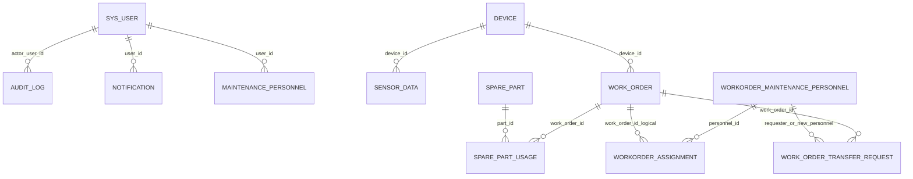

# SmartEnergyMaster 后端接口与数据库结构

> 整理日期：2026-06-12  
> 整理依据：当前工作区中的 Spring Boot 控制器、DTO、实体类、`deploy/docker-compose.yml`、`deploy/init-sql`，并已与本机运行中的 `smart_energy_db` 数据库实际结构交叉核对。

## 1. 后端概览

| 项目 | 当前实现 |
|---|---|
| 后端框架 | Spring Boot 3、Spring Security、MyBatis-Plus |
| 数据库 | PostgreSQL 14 + TimescaleDB |
| 缓存与辅助能力 | Redis、JWT、限流、分布式锁 |
| 默认服务地址 | `http://localhost:8080` |
| API 前缀 | `/api` |
| Swagger UI | `/swagger-ui.html` |
| OpenAPI JSON | `/v3/api-docs` |
| 默认数据库 | `smart_energy` |

### 1.1 鉴权约定

- 请求头格式：`Authorization: Bearer <JWT_TOKEN>`。
- JWT 默认有效期：24 小时。
- 无需登录的接口：
  - `/api/auth/**`
  - `POST /api/sensor/upload`
  - `GET /api/sensor/latest/**`
  - `GET /api/sensor/history/**`
- 其余接口默认要求登录。
- 特定角色限制：

| 权限范围 | 允许角色 |
|---|---|
| 用户管理 | `ADMIN`、`HR_MANAGER` |
| 审计日志 | `ADMIN` |
| 新建、更新、删除备件 | `DEVICE_MANAGER`、`ADMIN` |
| 发起转单申请 | `MAINTENANCE_ENGINEER`、`ADMIN` |
| 查看转单申请 | `MAINTENANCE_ENGINEER`、`DEVICE_MANAGER`、`ADMIN` |
| 审批转单申请 | `DEVICE_MANAGER`、`ADMIN` |

### 1.2 通用响应与错误

- 分页响应主要有两种：
  - 自定义 `PageVO<T>`：`total`、`page`、`size`、`records`。
  - MyBatis-Plus `Page<T>`：包含 `records`、`total`、`current`、`size` 等字段。
- 参数或业务状态错误一般返回：

```json
{
  "error": "错误信息"
}
```

- 常见状态码：
  - `400`：参数校验或非法业务操作。
  - `403`：无权限。
  - `409`：分布式锁竞争失败。
  - `429`：触发限流。
  - `500`：未处理的服务端异常。

---

## 2. 后端接口清单

当前控制器共划分为 17 个功能模块，包含约 71 个 HTTP 接口。

## 2.1 认证管理

基础路径：`/api/auth`

| 方法 | 路径 | 鉴权 | 说明 | 请求参数/请求体 | 返回 |
|---|---|---|---|---|---|
| POST | `/register` | 公开 | 注册新用户，默认角色 `OPERATOR` | `RegisterRequest` | 注册结果文本 |
| POST | `/login` | 公开 | 登录并获取 JWT；同一 IP 每分钟最多尝试 3 次 | `LoginRequest` | `LoginVO` |
| POST | `/logout` | 登录 | 退出并释放当前账号会话 | `Authorization` 请求头 | 退出结果文本 |

主要请求体：

- `RegisterRequest`：`username`、`password`、`email`。
- `LoginRequest`：`username`、`password`。
- `LoginVO`：`token`、`username`、`role`、`nickname`、`department`。

## 2.2 用户与人事管理

基础路径：`/api/users`，要求 `ADMIN` 或 `HR_MANAGER`。

| 方法 | 路径 | 说明 | 请求参数/请求体 | 返回 |
|---|---|---|---|---|
| GET | `/api/users` | 分页查询用户 | `page=1`、`size=10`、`keyword?`、`role?`、`department?`、`status?` | `PageVO<UserVO>` |
| POST | `/api/users` | 创建用户 | `UserUpsertRequest` | `UserVO` |
| PUT | `/api/users/{id}` | 更新用户 | 路径参数 `id` + `UserUpsertRequest` | `UserVO` |
| PATCH | `/api/users/{id}/status` | 更新用户状态 | 路径参数 `id` + 查询参数 `status` | `UserVO` |
| DELETE | `/api/users/{id}` | 删除用户 | 路径参数 `id` | 无 |

`UserUpsertRequest` 字段：`username`、`password?`、`role`、`nickname?`、`department?`、`phone?`、`email?`。

允许角色：`ADMIN`、`HR_MANAGER`、`MANAGER`、`OPERATOR`、`DEVICE_MANAGER`、`MAINTENANCE_ENGINEER`。

## 2.3 审计日志

基础路径：`/api/audit-logs`，仅允许 `ADMIN`。

| 方法 | 路径 | 说明 | 请求参数 | 返回 |
|---|---|---|---|---|
| GET | `/api/audit-logs` | 分页查询敏感操作审计日志 | `page=1`、`size=20`、`action?`、`module?`、`startAt?`、`endAt?` | `PageVO<AuditLogVO>` |

`startAt`、`endAt` 使用 ISO 8601 日期时间格式。

## 2.4 设备管理

基础路径：`/api/devices`

| 方法 | 路径 | 说明 | 请求参数/请求体 | 返回 |
|---|---|---|---|---|
| GET | `/api/devices` | 分页查询设备及最新传感器数据、状态、活跃工单数 | `page=1`、`size=20`、`type?`、`status?`、`keyword?` | `PageVO<DeviceOverviewVO>` |
| GET | `/api/devices/{id}` | 查询设备详情 | 路径参数 `id` | `DeviceOverviewVO` |
| GET | `/api/devices/{id}/fault-history` | 查询设备历史故障工单 | 路径参数 `id` | `List<WorkOrderVO>` |
| GET | `/api/devices/{id}/health-score` | 计算设备健康评分 | 路径参数 `id` | `DeviceHealthScoreVO` |
| POST | `/api/devices` | 创建设备 | `DeviceUpsertRequest` | `Device` |
| PUT | `/api/devices/{id}` | 更新设备 | 路径参数 `id` + `DeviceUpsertRequest` | `Device` |
| DELETE | `/api/devices/{id}` | 删除设备；传感器数据级联删除 | 路径参数 `id` | 无 |

`DeviceUpsertRequest` 字段：`deviceCode`、`deviceName`、`deviceType?`、`status?`、`location?`、`maintainer?`、`description?`。

## 2.5 传感器数据采集与查询

基础路径：`/api/sensor`，三个接口均公开。

| 方法 | 路径 | 说明 | 请求参数/请求体 | 返回 |
|---|---|---|---|---|
| POST | `/api/sensor/upload` | 上传单条对象或对象数组；带限流和同载荷分布式锁 | `SensorDataDTO` 或数组 | 结果文本 |
| GET | `/api/sensor/latest/{deviceCode}` | 查询设备最新传感器记录 | 路径参数 `deviceCode` | `SensorData` 或提示文本 |
| GET | `/api/sensor/history/{deviceCode}` | 查询最近 N 小时历史数据 | `hours=24`、`page?`、`size?` | 列表或 `PageVO<SensorData>` |

`SensorDataDTO` 字段：

| 字段 | 必填 | 说明 |
|---|---|---|
| `deviceCode` | 是 | 设备编码 |
| `usageKwh` | 是 | 能耗数据 |
| `co2Emission` | 否 | CO₂ 排放量 |
| `nsm` | 否 | 秒级时间编码 |
| `weekStatus` | 否 | `0=工作日`、`1=周末` |
| `dayOfWeek` | 否 | 星期 |
| `loadType` | 否 | 负载类型 |
| `xianPriceTier` | 否 | 西安电价时段 |
| `temperature` | 否 | 温度 |
| `vibration` | 否 | 振动 |
| `pressure` | 否 | 压力 |
| `operatingStatus` | 否 | `0=停机`、`1=空转`、`2=运行中`、`3=高负荷` |
| `time` | 否 | 数据采集时间 |

## 2.6 能源仪表盘与预测

基础路径：`/api/dashboard`

| 方法 | 路径 | 说明 | 请求参数/请求体 | 返回 |
|---|---|---|---|---|
| GET | `/api/dashboard/summary` | 全厂能耗、碳排放、设备、告警、预测聚合总览 | `deviceCode?` | `DashboardSummaryVO` |
| GET | `/api/dashboard/dispatch-advice` | 获取指定设备的调度建议 | `deviceCode` | `DispatchAdviceVO` |
| GET | `/api/dashboard/forecast` | 获取未来 15/30 分钟能耗预测及置信区间 | `deviceCode` | `List<ForecastPointVO>` |
| POST | `/api/dashboard/dispatch-advice/decision` | 记录操作员采纳或拒绝调度建议 | `{deviceCode, decision}` | 决策确认对象 |

`decision` 支持 `CONFIRM`、`REJECT`。当前决策接口只记录日志并返回确认结果，未持久化到数据库。

## 2.7 维修工单生命周期

基础路径：`/api/work-orders`

| 方法 | 路径 | 说明 | 请求参数/请求体 | 返回 |
|---|---|---|---|---|
| GET | `/api/work-orders` | 查询工单，可按状态筛选 | `status?` | `List<WorkOrderVO>` |
| GET | `/api/work-orders/active-alerts` | 查询活跃告警工单 | `limit=5` | `List<WorkOrderVO>` |
| POST | `/api/work-orders` | 手动创建工单，自动获取设备快照并匹配 SOP | `WorkOrderCreateRequest` | `WorkOrderVO` |
| PATCH | `/api/work-orders/{id}/status` | 工单状态流转并联动设备状态 | `WorkOrderStatusRequest` | `WorkOrderVO` |
| PATCH | `/api/work-orders/{id}/sop` | 为工单选择维修 SOP | `{sopId}` | `WorkOrderVO` |

主要枚举：

- 工单状态：`PENDING`、`IN_PROGRESS`、`RESOLVED`。
- 优先级：`CRITICAL`、`HIGH`、`MEDIUM`、`LOW`。
- 工单来源：`AUTO`、`MANUAL`。

主要请求体：

- `WorkOrderCreateRequest`：`deviceId`、`title`、`faultType`、`priority`、`description`。
- `WorkOrderStatusRequest`：`status`、`assignee?`、`note?`。
- `WorkOrderSopRequest`：`sopId`。

## 2.8 工单只读聚合查询

基础路径：`/api/workorder/orders`

| 方法 | 路径 | 说明 | 请求参数 | 返回 |
|---|---|---|---|---|
| GET | `/api/workorder/orders` | 分页查询工单，关联设备与活跃指派人员 | `status?`、`pageNum=1`、`pageSize=20` | `Page<WorkOrderReadVO>` |
| GET | `/api/workorder/orders/{id}` | 查询工单聚合详情 | 路径参数 `id` | `WorkOrderReadVO` |
| GET | `/api/workorder/orders/{id}/assignments` | 查询工单指派历史 | 路径参数 `id` | `List<WorkOrderAssignmentVO>` |

## 2.9 维修人员管理

基础路径：`/api/workorder/personnel`

| 方法 | 路径 | 说明 | 请求参数/请求体 | 返回 |
|---|---|---|---|---|
| GET | `/api/workorder/personnel` | 分页与筛选维修人员 | `pageNum=1`、`pageSize=20`、`specialization?`、`skillLevel?`、`onDuty?` | `Page<MaintenancePersonnelVO>` |
| GET | `/api/workorder/personnel/{id}` | 人员详情 | 路径参数 `id` | `MaintenancePersonnelVO` |
| POST | `/api/workorder/personnel` | 新增维修人员 | `MaintenancePersonnelRequest` | `MaintenancePersonnelVO` |
| PUT | `/api/workorder/personnel/{id}` | 编辑维修人员 | 路径参数 `id` + `MaintenancePersonnelRequest` | `MaintenancePersonnelVO` |
| DELETE | `/api/workorder/personnel/{id}` | 删除无当前工作负载的人员 | 路径参数 `id` | 无 |
| PATCH | `/api/workorder/personnel/{id}/duty` | 切换在岗状态 | 查询参数 `onDuty` | `MaintenancePersonnelVO` |

`MaintenancePersonnelRequest` 字段：`employeeNo`、`name`、`phone?`、`email?`、`avatarColor?`、`specializations?`、`skillLevel`、`certification?`、`maxWorkload`。

技能等级：`JUNIOR`、`INTERMEDIATE`、`SENIOR`、`EXPERT`。

## 2.10 工单指派与自动匹配

基础路径：`/api/workorder/orders`

| 方法 | 路径 | 说明 | 请求参数/请求体 | 返回 |
|---|---|---|---|---|
| POST | `/api/workorder/orders/{id}/assign` | 向工单指派单人 | `WorkOrderAssignRequest` | 无 |
| POST | `/api/workorder/orders/{id}/batch-assign` | 批量指派多人 | `BatchWorkOrderAssignRequest` | 无 |
| POST | `/api/workorder/orders/{id}/assignments/{personnelId}/release` | 释放指定人员 | 路径参数 | 无 |
| POST | `/api/workorder/orders/{id}/assignments/{personnelId}/replace` | 替换指定人员 | `WorkOrderReplaceRequest` | 无 |
| POST | `/api/workorder/orders/{id}/release` | 释放工单全部活跃指派 | 路径参数 `id` | 无 |
| GET | `/api/workorder/orders/auto-match` | 按故障类型自动匹配维修人员 | `faultType`、`workOrderId?`、`topN=5` | `DispatchMatchVO` |

指派角色：`PRIMARY`、`ASSIST`。

## 2.11 调度总览

基础路径：`/api/workorder`

| 方法 | 路径 | 说明 | 返回 |
|---|---|---|---|
| GET | `/api/workorder/dashboard/summary` | 人员在岗数、平均负载、技能覆盖和工单状态分布 | `DispatchSummaryVO` |
| GET | `/api/workorder/dispatch-board` | 按技能分组展示人员负载矩阵 | `DispatchBoardVO` |

## 2.12 工单转单审批

基础路径：`/api/work-orders`

| 方法 | 路径 | 权限 | 说明 | 请求参数/请求体 | 返回 |
|---|---|---|---|---|---|
| POST | `/api/work-orders/{id}/transfer-requests` | 工程师、管理员 | 发起转单申请 | `{reason}` | `WorkOrderTransferRequestVO` |
| GET | `/api/work-orders/transfer-requests` | 工程师、设备经理、管理员 | 查询转单申请 | `status?`、`mine=false` | `List<WorkOrderTransferRequestVO>` |
| PATCH | `/api/work-orders/transfer-requests/{id}/review` | 设备经理、管理员 | 审批转单申请 | `{approved, newPersonnelId?, reviewNote?}` | `WorkOrderTransferRequestVO` |

转单状态：`PENDING`、`APPROVED`、`REJECTED`。

## 2.13 维修 SOP

基础路径：`/api/sops`

| 方法 | 路径 | 说明 | 请求参数/请求体 | 返回 |
|---|---|---|---|---|
| GET | `/api/sops` | 筛选 SOP 列表 | `deviceType?`、`faultType?`、`keyword?` | `List<SOPDetailVO>` |
| GET | `/api/sops/{id}` | SOP 详情 | 路径参数 `id` | `SOPDetailVO` |
| GET | `/api/sops/match` | 按设备类型和故障类型匹配最佳 SOP | `deviceType?`、`faultType` | `SOPDetailVO` |
| POST | `/api/sops` | 新建 SOP | `SOPCreateRequest` | `SOPDetailVO` |
| PUT | `/api/sops/{id}` | 更新 SOP，版本号自动加一 | `SOPUpdateRequest` | `SOPDetailVO` |
| DELETE | `/api/sops/{id}` | 删除 SOP | 路径参数 `id` | 无 |

SOP 的 `steps`、`requiredSkills`、`requiredTools`、`requiredParts` 在 API 中为数组，在数据库中以文本形式保存 JSON 数组。

## 2.14 维修案例

基础路径：`/api/cases`

| 方法 | 路径 | 说明 | 请求参数/请求体 | 返回 |
|---|---|---|---|---|
| GET | `/api/cases` | 查询案例列表 | `deviceType?`、`faultType?`、`keyword?` | `List<CaseDetailVO>` |
| GET | `/api/cases/{id}` | 查询案例详情 | 路径参数 `id` | `CaseDetailVO` |
| GET | `/api/cases/similar` | 检索相似案例并评分排序 | `deviceType?`、`faultType?`、`keyword?`、`limit=5` | `List<CaseDetailVO>` |
| POST | `/api/cases` | 新建案例 | `CaseCreateRequest` | `CaseDetailVO` |
| PUT | `/api/cases/{id}` | 更新案例 | `CaseCreateRequest` | `CaseDetailVO` |
| POST | `/api/cases/from-work-order/{workOrderId}` | 从闭环工单提取案例 | `{title?, rootCause?, repairProcess?, technician?}` | `CaseDetailVO` |
| DELETE | `/api/cases/{id}` | 删除案例 | 路径参数 `id` | 无 |

## 2.15 维修知识图谱

基础路径：`/api/knowledge`

| 方法 | 路径 | 说明 | 请求参数 | 返回 |
|---|---|---|---|---|
| GET | `/api/knowledge/graph` | 返回设备、故障、SOP、案例关系图；支持 BFS 裁剪 | `center?`、`depth=2` | `KnowledgeGraphVO` |

`depth` 支持 `0-3`；返回结构为 ECharts graph 所需的 `nodes` 和 `links`。

## 2.16 AI 维修建议

基础路径：`/api/ai`

| 方法 | 路径 | 说明 | 请求体 | 返回 |
|---|---|---|---|---|
| POST | `/api/ai/repair-advice` | 检索最佳 SOP，并可使用 LLM 增强维修建议 | `RepairAdviceRequest` | `RepairAdviceVO` |

`RepairAdviceRequest` 字段：`deviceType`、`faultType`、`symptoms?`、`workOrderId?`、`useLlm=true`。

未配置 LLM API Key 时，服务会自动降级为纯 SOP 建议路径。

## 2.17 备件库存与领用

基础路径：`/api/spare-parts`

| 方法 | 路径 | 权限 | 说明 | 请求参数/请求体 | 返回 |
|---|---|---|---|---|---|
| GET | `/api/spare-parts` | 登录 | 查询库存，支持低库存筛选 | `keyword?`、`lowStockOnly?` | `List<SparePartVO>` |
| GET | `/api/spare-parts/{id}` | 登录 | 查询备件详情 | 路径参数 `id` | `SparePartVO` |
| POST | `/api/spare-parts` | 设备经理、管理员 | 新建备件 | `SparePartCreateRequest` | `SparePartVO` |
| PUT | `/api/spare-parts/{id}` | 设备经理、管理员 | 更新备件 | `SparePartCreateRequest` | `SparePartVO` |
| DELETE | `/api/spare-parts/{id}` | 设备经理、管理员 | 删除备件及领用记录 | 路径参数 `id` | 无 |
| POST | `/api/spare-parts/usage` | 登录 | 登记领用并自动扣减库存 | `SparePartUsageRequest` | `SparePartUsageVO` |
| POST | `/api/spare-parts/usage/batch` | 登录 | 批量提交配件领用 | `{items: SparePartUsageRequest[]}` | `List<SparePartUsageVO>` |
| GET | `/api/spare-parts/usage` | 登录 | 查询领用记录 | `partId?`、`workOrderId?`、`userName?`、`limit=20` | `List<SparePartUsageVO>` |

工程师查询领用记录时，后端会强制使用当前登录用户名；普通查询要求 `partId` 和 `workOrderId` 至少提供一个。

---

## 3. 数据库初始化与有效结构

Docker Compose 当前实际初始化顺序：

1. `01_init.sql`
2. `02_user_expansion.sql`
3. `03_audit_log.sql`
4. `04_llm_analysis.sql`
5. `07_carbon_config.sql`
6. `08_notification.sql`
7. SOP 与案例种子脚本
8. `09_workorder_audit_fixes.sql`
9. `10_transfer_requests.sql`

因此，下面的结构按以上脚本叠加后的最终结果整理，而不是只按单个 SQL 文件整理。

本机运行中的 `smart_energy_db` 已验证存在下列 15 张业务表，其字段、可空性和主要约束与本文结构一致。

### 3.1 表清单

| 功能域 | 表名 | 主要用途 | 当前后端实体/接口 |
|---|---|---|---|
| 用户权限 | `sys_user` | 登录账号、角色与用户档案 | 有实体、有认证和用户管理接口 |
| 用户权限 | `audit_log` | 敏感操作审计 | 无实体，有查询接口 |
| 用户权限 | `notification` | 用户站内通知 | 无实体，暂无后端接口 |
| 设备能耗 | `device` | 设备主数据 | 有实体、有接口 |
| 设备能耗 | `sensor_data` | 时序传感器与能耗数据 | 有实体、有接口；TimescaleDB 超表 |
| 设备能耗 | `carbon_quota` | 碳配额和排放因子配置 | 无实体，暂无后端接口 |
| 工单调度 | `work_order` | 维修工单 | 有实体、有接口 |
| 工单调度 | `workorder_maintenance_personnel` | 当前调度模块实际使用的维修人员表 | 有实体、有接口 |
| 工单调度 | `workorder_assignment` | 工单与维修人员指派关系 | 有实体、有接口 |
| 工单调度 | `work_order_transfer_request` | 工单转单申请与审批 | 有实体、有接口 |
| 人员档案 | `maintenance_personnel` | 另一套带 `user_id` 的维修人员档案表 | 无实体，当前业务未使用 |
| 维修知识 | `maintenance_sop` | 维修标准操作规程 | 有实体、有接口 |
| 维修知识 | `repair_case` | 维修案例库 | 有实体、有接口 |
| 备件库存 | `spare_part` | 备件库存主表 | 有实体、有接口 |
| 备件库存 | `spare_part_usage` | 备件领用记录 | 有实体、有接口 |

### 3.2 主要关系



> `workorder_assignment.work_order_id`、`work_order.sop_id`、`repair_case.related_work_order_id` 在当前 SQL 中是逻辑关联，没有数据库外键约束。

---

## 4. 数据库表结构

字段约定：`PK` 为主键，`FK` 为外键，`UK` 为唯一约束。

## 4.1 `sys_user` 系统用户

| 字段 | 类型 | 约束/默认值 | 说明 |
|---|---|---|---|
| `id` | `SERIAL` | PK | 用户 ID |
| `username` | `VARCHAR(64)` | UK、NOT NULL | 登录用户名 |
| `password` | `VARCHAR(255)` | NOT NULL | BCrypt 密码 |
| `role` | `VARCHAR(32)` | NOT NULL、`OPERATOR` | 用户角色 |
| `nickname` | `VARCHAR(64)` | 可空 | 姓名/昵称 |
| `department` | `VARCHAR(64)` | 可空 | 部门 |
| `phone` | `VARCHAR(32)` | 可空 | 手机号 |
| `email` | `VARCHAR(128)` | 可空 | 邮箱 |
| `avatar_url` | `VARCHAR(255)` | 可空 | 头像地址 |
| `status` | `VARCHAR(32)` | NOT NULL、`ACTIVE` | 账号状态 |
| `last_login_at` | `TIMESTAMP` | 可空 | 最后登录时间 |
| `created_at` | `TIMESTAMP` | NOT NULL、当前时间 | 创建时间 |
| `updated_at` | `TIMESTAMP` | NOT NULL、当前时间 | 更新时间 |

索引：`username` 唯一索引、`status`、`department`。

## 4.2 `device` 设备

| 字段 | 类型 | 约束/默认值 | 说明 |
|---|---|---|---|
| `id` | `SERIAL` | PK | 设备 ID |
| `device_code` | `VARCHAR(64)` | UK、NOT NULL | 设备编码 |
| `device_name` | `VARCHAR(128)` | NOT NULL | 设备名称 |
| `device_type` | `VARCHAR(64)` | 可空 | 设备类型 |
| `status` | `VARCHAR(32)` | NOT NULL、`STOPPED` | 设备状态 |
| `location` | `VARCHAR(128)` | 可空 | 安装位置 |
| `maintainer` | `VARCHAR(64)` | 可空 | 维护负责人 |
| `description` | `VARCHAR(255)` | 可空 | 描述 |
| `created_at` | `TIMESTAMP` | NOT NULL、当前时间 | 创建时间 |
| `updated_at` | `TIMESTAMP` | NOT NULL、当前时间 | 更新时间 |

## 4.3 `sensor_data` 传感器时序数据

该表通过 `create_hypertable('sensor_data', 'time')` 转换为 TimescaleDB 超表。

| 字段 | 类型 | 约束/默认值 | 说明 |
|---|---|---|---|
| `id` | `BIGSERIAL` | 复合 PK | 数据 ID |
| `time` | `TIMESTAMPTZ` | 复合 PK、当前时间 | 采集时间 |
| `device_id` | `INTEGER` | FK → `device.id`、NOT NULL、级联删除 | 设备 ID |
| `usage_kwh` | `NUMERIC(12,2)` | NOT NULL | 能耗 |
| `co2_emission` | `NUMERIC(12,2)` | 可空 | CO₂ 排放 |
| `nsm` | `INTEGER` | 可空 | 秒级时间编码 |
| `week_status` | `INTEGER` | 可空 | 工作日/周末状态 |
| `day_of_week` | `VARCHAR(32)` | 可空 | 星期 |
| `load_type` | `VARCHAR(32)` | 可空 | 负载类型 |
| `xian_price_tier` | `VARCHAR(32)` | 可空 | 电价时段 |
| `temperature` | `NUMERIC(12,2)` | 可空 | 温度 |
| `vibration` | `NUMERIC(12,2)` | 可空 | 振动 |
| `pressure` | `NUMERIC(12,2)` | 可空 | 压力 |
| `operating_status` | `INTEGER` | 可空 | 运行状态 |

索引：`(device_id, time DESC)`。

## 4.4 `work_order` 维修工单

| 字段 | 类型 | 约束/默认值 | 说明 |
|---|---|---|---|
| `id` | `BIGSERIAL` | PK | 工单 ID |
| `order_no` | `VARCHAR(64)` | UK、NOT NULL | 工单编号 |
| `device_id` | `INTEGER` | FK → `device.id`、NOT NULL、级联删除 | 设备 ID |
| `title` | `VARCHAR(128)` | NOT NULL | 标题 |
| `fault_type` | `VARCHAR(64)` | NOT NULL | 故障类型 |
| `description` | `VARCHAR(500)` | 可空 | 故障描述 |
| `status` | `VARCHAR(32)` | NOT NULL | 工单状态 |
| `priority` | `VARCHAR(32)` | NOT NULL、`HIGH` | 优先级 |
| `assignee` | `VARCHAR(64)` | 可空 | 兼容字段：处理人名称 |
| `source` | `VARCHAR(16)` | NOT NULL、`AUTO` | `AUTO` 或 `MANUAL` |
| `source_time` | `TIMESTAMPTZ` | 可空 | 故障源数据时间 |
| `accepted_at` | `TIMESTAMP` | 可空 | 接单时间 |
| `resolved_at` | `TIMESTAMP` | 可空 | 解决时间 |
| `latest_temperature` | `NUMERIC(12,2)` | 可空 | 触发时温度快照 |
| `latest_vibration` | `NUMERIC(12,2)` | 可空 | 触发时振动快照 |
| `latest_pressure` | `NUMERIC(12,2)` | 可空 | 触发时压力快照 |
| `sop_id` | `BIGINT` | 可空、逻辑关联 | 选中的 SOP ID |
| `llm_analysis` | `JSONB` | NOT NULL、`{}` | LLM 分析结果 |
| `llm_analysis_at` | `TIMESTAMP` | 可空 | LLM 分析时间 |
| `llm_model` | `VARCHAR(64)` | 可空 | LLM 模型名称 |
| `created_at` | `TIMESTAMP` | NOT NULL、当前时间 | 创建时间 |
| `updated_at` | `TIMESTAMP` | NOT NULL、当前时间 | 更新时间 |

关键索引：

- `(status, created_at DESC)`。
- `(device_id, fault_type, status)`。
- `source`。
- `llm_analysis` GIN 索引。
- `(device_id, fault_type)` 条件唯一索引：状态为 `PENDING` 或 `IN_PROGRESS` 时，同设备同故障只允许一个活跃工单。

## 4.5 `workorder_maintenance_personnel` 调度维修人员

当前维修人员控制器、指派和自动匹配实际使用此表。

| 字段 | 类型 | 约束/默认值 | 说明 |
|---|---|---|---|
| `id` | `BIGSERIAL` | PK | 人员 ID |
| `employee_no` | `VARCHAR(32)` | UK、NOT NULL | 工号 |
| `name` | `VARCHAR(64)` | NOT NULL | 姓名 |
| `phone` | `VARCHAR(32)` | 可空 | 手机号 |
| `email` | `VARCHAR(128)` | 可空 | 邮箱 |
| `avatar_color` | `VARCHAR(16)` | `#52c8ff` | 头像颜色 |
| `specializations` | `JSONB` | `[]` | 技能标签 |
| `skill_level` | `VARCHAR(16)` | NOT NULL、`JUNIOR` | 技能等级 |
| `certification` | `VARCHAR(255)` | 可空 | 资质证书 |
| `current_workload` | `INT` | NOT NULL、`0` | 当前负载 |
| `max_workload` | `INT` | NOT NULL、`5` | 最大负载 |
| `is_on_duty` | `BOOLEAN` | NOT NULL、`TRUE` | 是否在岗 |
| `created_at` | `TIMESTAMP` | NOT NULL、当前时间 | 创建时间 |
| `updated_at` | `TIMESTAMP` | NOT NULL、当前时间 | 更新时间 |

索引：`skill_level`、`is_on_duty`。

## 4.6 `workorder_assignment` 工单指派关系

| 字段 | 类型 | 约束/默认值 | 说明 |
|---|---|---|---|
| `id` | `BIGSERIAL` | PK | 指派 ID |
| `work_order_id` | `BIGINT` | NOT NULL、逻辑关联 | 工单 ID |
| `personnel_id` | `BIGINT` | FK → `workorder_maintenance_personnel.id`、删除人员时置空 | 人员 ID |
| `role` | `VARCHAR(32)` | NOT NULL、`PRIMARY` | 指派角色 |
| `assigned_at` | `TIMESTAMP` | NOT NULL、当前时间 | 指派时间 |
| `released_at` | `TIMESTAMP` | 可空 | 释放时间；为空表示活跃 |
| `note` | `VARCHAR(255)` | 可空 | 备注 |

关键索引：

- `work_order_id`、`personnel_id`。
- `(work_order_id, personnel_id)` 活跃记录条件索引。
- `(work_order_id, personnel_id)` 条件唯一索引，防止重复活跃指派。

## 4.7 `work_order_transfer_request` 工单转单申请

| 字段 | 类型 | 约束/默认值 | 说明 |
|---|---|---|---|
| `id` | `BIGSERIAL` | PK | 申请 ID |
| `work_order_id` | `BIGINT` | FK → `work_order.id`、级联删除 | 工单 ID |
| `requester_personnel_id` | `BIGINT` | FK → 调度维修人员、NOT NULL | 申请人 |
| `reason` | `VARCHAR(500)` | NOT NULL | 转单原因 |
| `status` | `VARCHAR(32)` | NOT NULL、`PENDING`、CHECK | 审批状态 |
| `reviewer_username` | `VARCHAR(64)` | 可空 | 审批人用户名 |
| `new_personnel_id` | `BIGINT` | FK → 调度维修人员、可空 | 新指派人员 |
| `review_note` | `VARCHAR(500)` | 可空 | 审批备注 |
| `requested_at` | `TIMESTAMP` | NOT NULL、当前时间 | 申请时间 |
| `reviewed_at` | `TIMESTAMP` | 可空 | 审批时间 |

状态仅允许 `PENDING`、`APPROVED`、`REJECTED`。同一工单和申请人在同一时间只允许一个待审批申请。

## 4.8 `maintenance_personnel` 人员档案

该表由用户扩展脚本创建，但当前维修人员业务实际使用的是 `workorder_maintenance_personnel`。

| 字段 | 类型 | 约束/默认值 | 说明 |
|---|---|---|---|
| `id` | `BIGSERIAL` | PK | 人员 ID |
| `user_id` | `INTEGER` | FK → `sys_user.id`、删除用户时置空 | 账号 ID |
| `employee_no` | `VARCHAR(32)` | UK、NOT NULL | 工号 |
| `name` | `VARCHAR(64)` | NOT NULL | 姓名 |
| `phone` | `VARCHAR(32)` | 可空 | 手机号 |
| `email` | `VARCHAR(128)` | 可空 | 邮箱 |
| `specializations` | `JSONB` | NOT NULL、`[]` | 技能标签 |
| `skill_level` | `VARCHAR(16)` | NOT NULL、`JUNIOR` | 技能等级 |
| `certification` | `VARCHAR(255)` | 可空 | 资质证书 |
| `current_workload` | `INT` | NOT NULL、`0` | 当前负载 |
| `max_workload` | `INT` | NOT NULL、`5` | 最大负载 |
| `is_on_duty` | `BOOLEAN` | NOT NULL、`TRUE` | 是否在岗 |
| `created_at` | `TIMESTAMP` | NOT NULL、当前时间 | 创建时间 |
| `updated_at` | `TIMESTAMP` | NOT NULL、当前时间 | 更新时间 |

约束：`current_workload >= 0`、`max_workload >= 0`、`current_workload <= max_workload`。

## 4.9 `maintenance_sop` 维修 SOP

| 字段 | 类型 | 约束/默认值 | 说明 |
|---|---|---|---|
| `id` | `BIGSERIAL` | PK | SOP ID |
| `sop_code` | `VARCHAR(64)` | UK、NOT NULL | SOP 编号 |
| `device_type` | `VARCHAR(64)` | NOT NULL | 设备类型 |
| `fault_type` | `VARCHAR(64)` | NOT NULL | 故障类型 |
| `title` | `VARCHAR(128)` | NOT NULL | 标题 |
| `summary` | `VARCHAR(500)` | 可空 | 简介 |
| `content` | `TEXT` | NOT NULL | Markdown 正文 |
| `steps` | `TEXT` | NOT NULL、`[]` | JSON 数组文本 |
| `required_skills` | `TEXT` | NOT NULL、`[]` | JSON 数组文本 |
| `required_tools` | `TEXT` | NOT NULL、`[]` | JSON 数组文本 |
| `required_parts` | `TEXT` | NOT NULL、`[]` | JSON 数组文本 |
| `estimated_minutes` | `INTEGER` | NOT NULL、`60` | 预计耗时 |
| `version` | `INTEGER` | NOT NULL、`1` | 版本号 |
| `is_active` | `BOOLEAN` | NOT NULL、`TRUE` | 是否启用 |
| `created_by` | `VARCHAR(64)` | 可空 | 创建人 |
| `created_at` | `TIMESTAMP` | NOT NULL、当前时间 | 创建时间 |
| `updated_at` | `TIMESTAMP` | NOT NULL、当前时间 | 更新时间 |

索引：`(device_type, fault_type)`、`is_active`。

## 4.10 `repair_case` 维修案例

| 字段 | 类型 | 约束/默认值 | 说明 |
|---|---|---|---|
| `id` | `BIGSERIAL` | PK | 案例 ID |
| `case_code` | `VARCHAR(64)` | UK、NOT NULL | 案例编号 |
| `title` | `VARCHAR(128)` | NOT NULL | 标题 |
| `device_type` | `VARCHAR(64)` | NOT NULL | 设备类型 |
| `fault_type` | `VARCHAR(64)` | NOT NULL | 故障类型 |
| `fault_symptom` | `VARCHAR(500)` | 可空 | 故障现象 |
| `root_cause` | `VARCHAR(500)` | 可空 | 根因 |
| `repair_process` | `TEXT` | 可空 | 维修过程 |
| `repair_result` | `VARCHAR(500)` | 可空 | 维修结果 |
| `duration_minutes` | `INTEGER` | 可空 | 维修耗时 |
| `technician` | `VARCHAR(64)` | 可空 | 维修人员 |
| `keywords` | `VARCHAR(500)` | 可空 | 关键词 |
| `related_work_order_id` | `BIGINT` | 可空、逻辑关联 | 关联工单 ID |
| `occurred_at` | `TIMESTAMP` | 可空 | 发生时间 |
| `created_at` | `TIMESTAMP` | NOT NULL、当前时间 | 创建时间 |
| `updated_at` | `TIMESTAMP` | NOT NULL、当前时间 | 更新时间 |

索引：`(device_type, fault_type)`、`occurred_at DESC`。

## 4.11 `spare_part` 备件库存

| 字段 | 类型 | 约束/默认值 | 说明 |
|---|---|---|---|
| `id` | `BIGSERIAL` | PK | 备件 ID |
| `part_code` | `VARCHAR(64)` | UK、NOT NULL | 备件编号 |
| `name` | `VARCHAR(128)` | NOT NULL | 名称 |
| `spec` | `VARCHAR(256)` | 可空 | 规格 |
| `unit` | `VARCHAR(32)` | NOT NULL、`件` | 单位 |
| `quantity` | `INTEGER` | NOT NULL、`0` | 当前库存 |
| `safety_stock` | `INTEGER` | NOT NULL、`0` | 安全库存 |
| `unit_price` | `NUMERIC(12,2)` | 可空 | 单价 |
| `supplier` | `VARCHAR(128)` | 可空 | 供应商 |
| `location` | `VARCHAR(128)` | 可空 | 存放位置 |
| `created_at` | `TIMESTAMP` | NOT NULL、当前时间 | 创建时间 |
| `updated_at` | `TIMESTAMP` | NOT NULL、当前时间 | 更新时间 |

索引：`part_code`、`quantity`。

## 4.12 `spare_part_usage` 备件领用记录

| 字段 | 类型 | 约束/默认值 | 说明 |
|---|---|---|---|
| `id` | `BIGSERIAL` | PK | 领用 ID |
| `part_id` | `BIGINT` | FK → `spare_part.id`、级联删除 | 备件 ID |
| `work_order_id` | `BIGINT` | FK → `work_order.id`、删除工单时置空 | 工单 ID |
| `quantity` | `INTEGER` | NOT NULL | 领用数量 |
| `user_name` | `VARCHAR(64)` | 可空 | 领用人 |
| `note` | `VARCHAR(256)` | 可空 | 备注 |
| `used_at` | `TIMESTAMP` | NOT NULL、当前时间 | 领用时间 |
| `created_at` | `TIMESTAMP` | NOT NULL、当前时间 | 创建时间 |

索引：`part_id`、`work_order_id`、`used_at DESC`。

## 4.13 `audit_log` 审计日志

| 字段 | 类型 | 约束/默认值 | 说明 |
|---|---|---|---|
| `id` | `BIGSERIAL` | PK | 日志 ID |
| `actor_user_id` | `INTEGER` | FK → `sys_user.id`、删除用户时置空 | 操作人 ID |
| `actor_username` | `VARCHAR(64)` | 可空 | 操作人用户名快照 |
| `action` | `VARCHAR(64)` | NOT NULL | 操作动作 |
| `module` | `VARCHAR(64)` | NOT NULL | 业务模块 |
| `target_type` | `VARCHAR(64)` | 可空 | 目标类型 |
| `target_id` | `VARCHAR(64)` | 可空 | 目标 ID |
| `request_id` | `VARCHAR(64)` | 可空 | 请求 ID |
| `ip_address` | `VARCHAR(64)` | 可空 | 客户端 IP |
| `user_agent` | `VARCHAR(255)` | 可空 | User-Agent |
| `old_value` | `JSONB` | 可空 | 变更前值 |
| `new_value` | `JSONB` | 可空 | 变更后值 |
| `detail` | `JSONB` | NOT NULL、`{}` | 详情 |
| `created_at` | `TIMESTAMPTZ` | NOT NULL、当前时间 | 创建时间 |

索引：操作人时间、模块时间、目标对象、`detail` GIN 索引。

## 4.14 `carbon_quota` 碳配额配置

| 字段 | 类型 | 约束/默认值 | 说明 |
|---|---|---|---|
| `id` | `BIGSERIAL` | PK | 配置 ID |
| `quota_year` | `INT` | NOT NULL | 年份 |
| `quota_month` | `INT` | NOT NULL、`0`、CHECK 0-12 | 月份；0 可表示年度 |
| `quota_type` | `VARCHAR(32)` | NOT NULL、`PLANT` | 配额类型 |
| `quota_value` | `NUMERIC(14,4)` | NOT NULL | 配额值 |
| `emission_factor` | `NUMERIC(12,6)` | NOT NULL、`0.570300` | 排放因子 |
| `price_tier` | `VARCHAR(32)` | 可空 | 电价时段 |
| `alert_threshold` | `NUMERIC(5,2)` | NOT NULL、`0.90`、CHECK `(0,1]` | 预警阈值 |
| `effective_from` | `DATE` | NOT NULL、当前日期 | 生效日期 |
| `effective_to` | `DATE` | 可空 | 失效日期 |
| `created_at` | `TIMESTAMP` | NOT NULL、当前时间 | 创建时间 |
| `updated_at` | `TIMESTAMP` | NOT NULL、当前时间 | 更新时间 |

唯一约束：`(quota_year, quota_month, quota_type)`。

## 4.15 `notification` 用户通知

| 字段 | 类型 | 约束/默认值 | 说明 |
|---|---|---|---|
| `id` | `BIGSERIAL` | PK | 通知 ID |
| `user_id` | `INTEGER` | FK → `sys_user.id`、删除用户时置空 | 接收用户 |
| `type` | `VARCHAR(32)` | NOT NULL、`SYSTEM` | 通知类型 |
| `title` | `VARCHAR(128)` | NOT NULL | 标题 |
| `content` | `TEXT` | 可空 | 内容 |
| `biz_type` | `VARCHAR(64)` | 可空 | 业务类型 |
| `biz_id` | `VARCHAR(64)` | 可空 | 业务 ID |
| `severity` | `VARCHAR(32)` | NOT NULL、`INFO` | 严重程度 |
| `channel` | `VARCHAR(32)` | NOT NULL、`IN_APP` | 通知渠道 |
| `is_read` | `BOOLEAN` | NOT NULL、`FALSE` | 是否已读 |
| `read_at` | `TIMESTAMP` | 可空 | 阅读时间 |
| `created_at` | `TIMESTAMP` | NOT NULL、当前时间 | 创建时间 |

索引：`(user_id, is_read, created_at DESC)`、`(biz_type, biz_id)`。

---

## 5. 当前结构注意事项

1. **存在两张维修人员表。** 当前调度接口使用 `workorder_maintenance_personnel`；`maintenance_personnel` 暂无实体和业务入口，容易造成数据重复或认知混淆。
2. **部分逻辑关联没有外键。** `workorder_assignment.work_order_id`、`work_order.sop_id`、`repair_case.related_work_order_id` 没有数据库外键约束，需要应用层保证引用有效。
3. **`workorder_assignment.personnel_id` 存在 SQL 约束冲突风险。** `01_init.sql` 将其定义为 `NOT NULL`，增量脚本又添加 `ON DELETE SET NULL` 外键；删除人员时数据库无法把非空列置空。
4. **`init.sql` 与 Docker 实际初始化脚本不是同一套。** Docker 使用 `01_init.sql` 加增量脚本；手工运行 `init.sql` 得到的约束和索引可能与 Docker 环境不同。
5. **`maintenance_sop` 的数组字段是 `TEXT`。** API 将其作为数组处理，但数据库保存 JSON 字符串，不具备原生 JSONB 校验和查询能力。
6. **部分表暂未接入后端业务。** `carbon_quota`、`notification`、`maintenance_personnel` 当前没有对应控制器；`notification` 前端组件与数据库表是否贯通需另行确认。
7. **数据库字段多于工单实体。** `work_order` 表包含 `llm_analysis`、`llm_analysis_at`、`llm_model`，但 `WorkOrder` 实体当前未声明这些字段，主要由其他查询或原生 SQL 使用。
